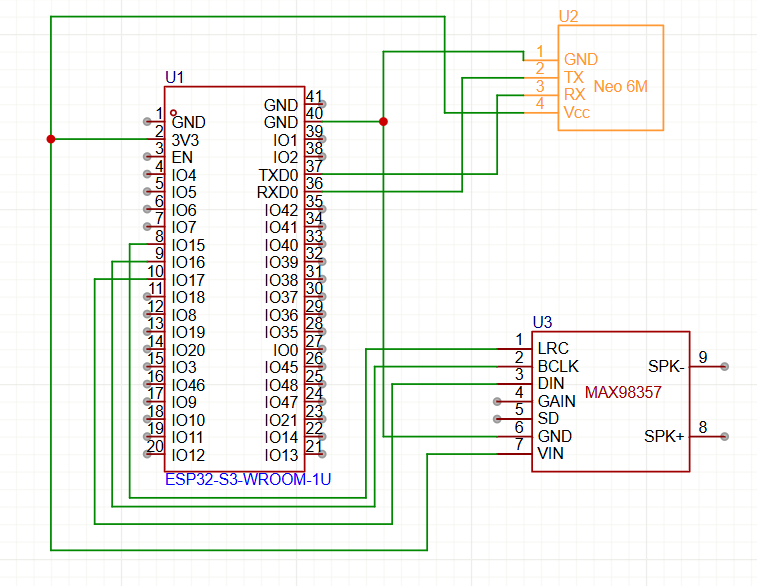
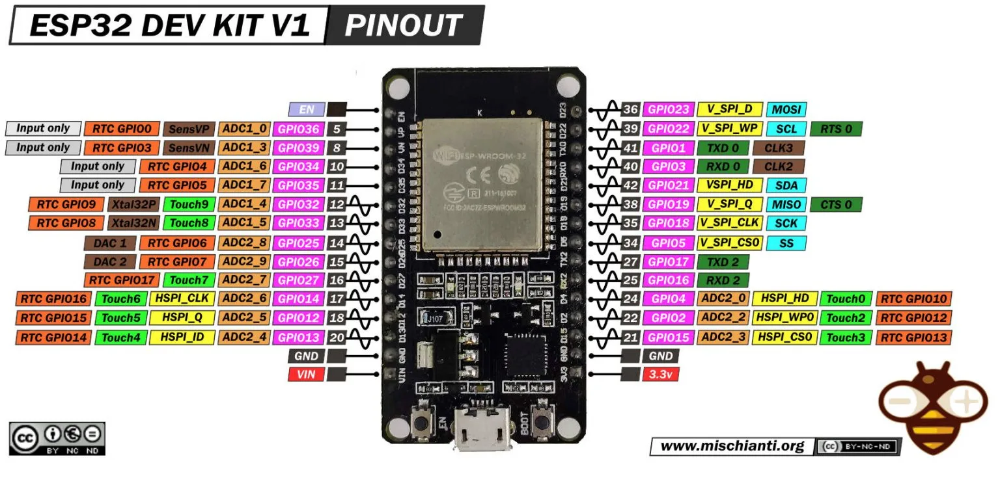

<p align="center">
  
</p>

<h1 align="center">📡 ESP32 GPS Detektor Pevných Radarů</h1>

<p align="center">
  
  
  
</p>

<p align="center">
  🚗 ➜ 📍 ➜ 📐 ➜ 🔊
</p>

<p align="center">
  <b>Mikropočítačový systém pro detekci pevných radarů </b><br>
  VS Code • PlatformIO • C++ 
</p>

---

## ✨ Přehled projektu

Projekt se zabývá návrhem a realizací **GPS detektoru pevných radarů** postaveného na mikropočítači **ESP32**.

Zařízení v reálném čase sleduje aktuální polohu vozidla pomocí GPS modulu **NEO-6M** a porovnává ji s **lokální databází pevných radarů**, uloženou přímo v paměti zařízení.

Pokud se vozidlo přiblíží na vzdálenost **200 metrů** k některému z radarů, systém uživatele upozorní:
- krátkým **akustickým pípnutím**, nebo  
- **vlastní (custom) TTS hlasovou zprávou**

Zvukový výstup je realizován pomocí digitálního zesilovače **MAX98357** a mini reproduktoru.

---

## ⚙️ Hardwarové komponenty

| Komponenta | Popis |
|----------|------|
| ESP32 | hlavní mikropočítač |
| NEO-6M | GPS modul (UART) |
| MAX98357 | digitální audio zesilovač |
| Mini reproduktor | zvukový výstup |
| USB-C (5 V) | napájení zařízení |

---

## 🔌 Napájení

Zařízení je napájeno pomocí **5 V přes USB-C konektor**, což umožňuje:
- napájení z **nabíječky v automobilu**
- napájení z **powerbanky**
- napájení z běžné USB nabíječky (stejně jako mobilní telefon)

Tento způsob napájení zajišťuje jednoduché a praktické použití v automobilu.

---

## 📡 GPS modul a přesnost

Pro určování polohy je použit GPS modul **NEO-6M**.

Pro dosažení lepší přesnosti polohy je doporučeno:
- použít **externí GPS anténu** kompatibilní s NEO-6M  
- umístit anténu na místo s dobrým výhledem na oblohu  

Externí anténa:
- zlepšuje přesnost polohy  
- zrychluje čas prvotní GPS fixace  

---

## 🔗 Propojení komponent

Propojení mezi ESP32 a ostatními komponentami je realizováno:
- **pájenými spoji** (finální řešení), nebo  
- pomocí **female-to-female Dupont kabelů** (vývojové zapojení)
## Piny a Zapojení
<p align="center">
  
  
  <br>
  <em style="margin-right: 25%; display: inline-block;">Prototyp</em>
  <em style="display: inline-block;">Finální verze</em>
</p>
---

## 💻 Vývojové prostředí

Firmware je vyvíjen ve **Visual Studio Code** s rozšířením **PlatformIO**.

Použití PlatformIO bylo zvoleno z **technických důvodů**:
- použité ESP32 je osazeno **nestandardní frekvencí krystalu**
- **Arduino IDE neumožňovalo tuto frekvenci upravit**
- v PlatformIO lze frekvenci krystalu explicitně nastavit
  v souboru `platformio.ini`

Toto řešení zajistilo:
- stabilní běh systému  
- správnou funkci periferií  
- profesionální strukturu projektu  

---

## 📚 Použité knihovny

### TinyGPS / TinyGPS++
Pro správnou funkci GPS modulu **NEO-6M** je použita knihovna  
**TinyGPS (resp. TinyGPS++)**, která:
- parsuje NMEA věty z GPS modulu  
- převádí surová data na souřadnice  
- umožňuje efektivní práci s GPS daty v reálném čase  

Použití této knihovny je **nezbytné** pro funkčnost projektu.

---

## 🌍 Data o radarech

Databáze pevných radarů je vytvořena z **otevřených dat OpenStreetMap**.

### Získání dat:
1. stažení dat pomocí **Overpass API**
2. filtrování a vizualizace v **overpass.turbo**
3. zpracování pomocí **vlastního HTML konvertoru**
4. manuální import do ESP32 jako lokální databáze

### Důležité informace:
- data jsou **komunitně (user-logged) spravovaná**
- databáze **nemusí být 100% přesná ani aktuální**
- aktualizace databáze probíhá **manuálně**
- systém nezaručuje úplnou spolehlivost detekce

  Citace:
  Tento projekt byl vytvořrn s pomocí ChatGPT a Grok , nevycházel jsem z žádneho jiného projektu.

---

## 🧠 Princip funkce

```text
🚗 Pohyb vozidla
      ↓
📍 GPS NEO-6M
      ↓ (UART)
🧠 ESP32 ── 📂 Databáze radarů
      ↓
📐 Výpočet vzdálenosti (< 200 m)
      ↓
🔊 Akustické / TTS upozornění

⚠️ Upozornění
Tento projekt je vytvořen jako školní (ročníkový) projekt.
Slouží výhradně ke studijním a výukovým účelům.

není certifikovaný
nemusí být 100% spolehlivý
není určen k použití v reálném silničním provozu
